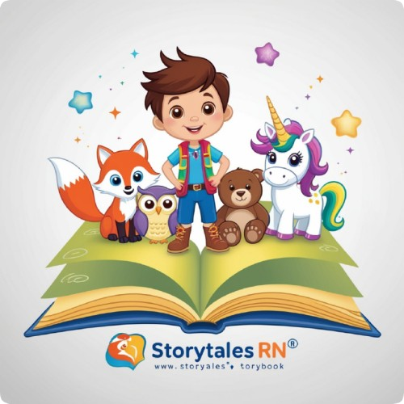

<h1 align="center">StoryTales AI</h1>

<p align="center">
  
</p>

<h4 align="center">Crie histórias infantis únicas com o poder da Inteligência Artificial</h4>

<p align="center">
  <a href="https://github.com/RNanWP/FullStack-IA.Story-Uni9">
    <!--  -->
  </a>
</p>

<br>

## 📖 Sobre o projeto

<strong>StoryTales AI</strong> é uma plataforma inovadora que utiliza Inteligência Artificial para criar histórias infantis personalizadas com base no tema sugerido pela criança. Basta inserir uma palavra-chave, como "carro de corrida", e o site gera uma história divertida e criativa.

## 🚀 Tecnologias Utilizadas

<ul>
  <li><strong>Front-end:</strong> React, Tailwind CSS</li>
  <li><strong>Back-end:</strong> Node.js, Next.js</li>
  <li><strong>API de IA:</strong> OpenAI GPT</li>
  <!--<li><strong>Banco de Dados:</strong> MongoDB</li>-->
</ul>

<br>

## ⚙️ Funcionalidades

- Criação de histórias infantis com base no input do usuário
- Interface amigável e responsiva
<!-- - Possibilidade de salvar histórias favoritas -->
<!-- - Compartilhamento de histórias via redes sociais -->

<br>

## 📦 Como Instalar e Rodar o Projeto

```bash
# Clone este repositório
git clone https://github.com/RNanWP/FullStack-IA.Story-Uni9.git

# Navegue até o diretório do projeto
cd storytales-ai

# Instale as dependências
npm install

# Execute o projeto
npm run dev
